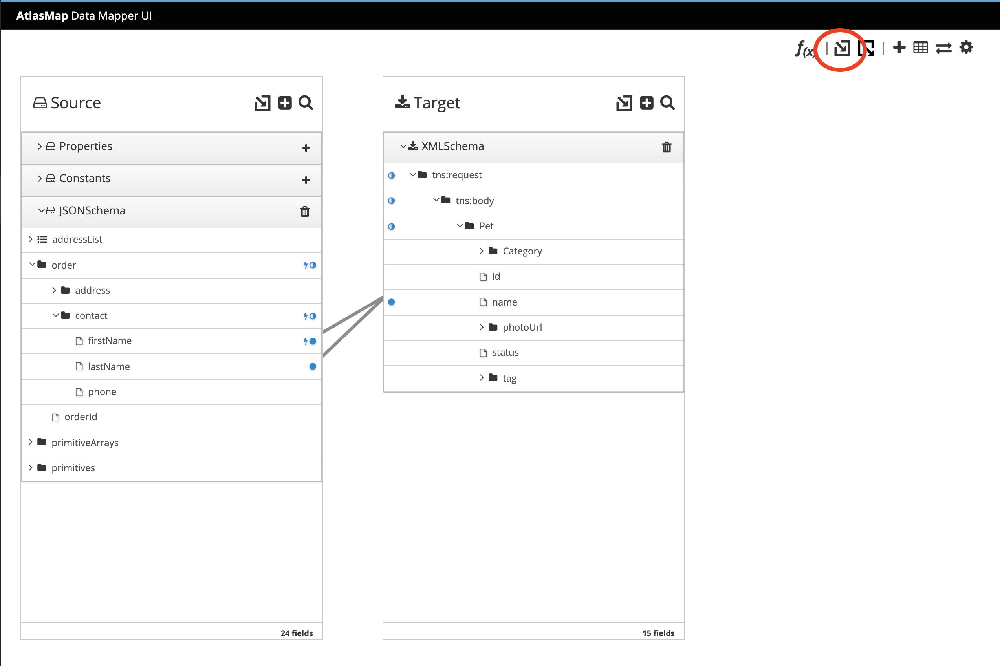
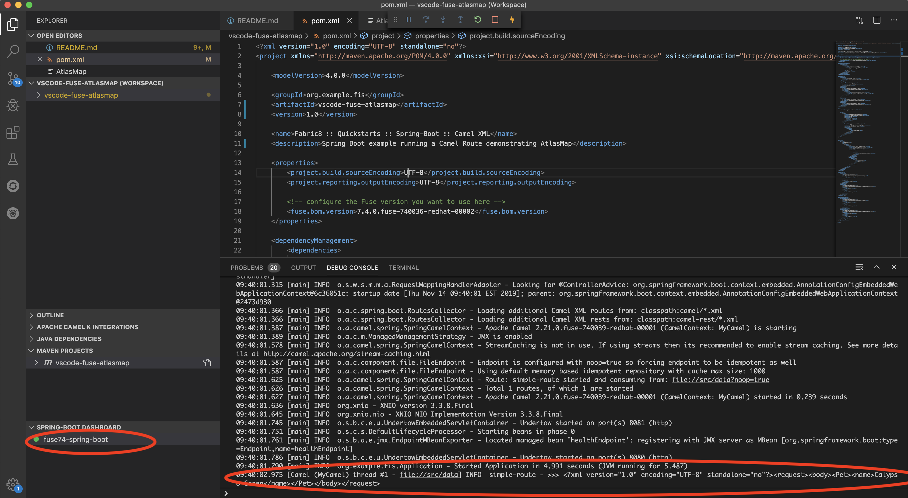

AtlasMap running in VSCode with Red Hat Fuse (Apache Camel)
====================================

Demonstration of a simple JSON to XML mapping in Camel using the AtlasMap UI running inside of VSCode

## Prerequisites

- VSCode 1.4+
- AtlasMap Data Transformation editor VSCode extension (found [here](https://marketplace.visualstudio.com/items?itemName=redhat.atlasmap-viewer))
- Language Support for Apache Camel by Red Hat entension (found [here](https://marketplace.visualstudio.com/items?itemName=redhat.vscode-apache-camel))
- Extension Pack for Apache Camel by Red Hat (found [here](https://marketplace.visualstudio.com/items?itemName=redhat.apache-camel-extension-pack))

## Mapping

To view (or edit) the mapping, you can open the AtlasMap editor using the following procedure:

1. Navigate to View > Command Palette...
2. Type `>AtlasMap > Open AtlasMap` in the command window and press Enter.
3. Click the `Import an Atlas Map` button located in the top right corner.  Select the map located in `src/main/resources/map` directory.

4. Notice that a JSON schema was imported as the source data type, and XML schema as the target data type.  Both schemas are located in the `/schema` directory.

## Running the example in VSCode

To run this example using Standalone SpringBoot in VSCode, follow this procedure:

1. Via the Spring-Boot Dashboard, select the project and click the *Play* button.

2. A *Debug Console* should appear and show the output XML for the newly created Pet object.